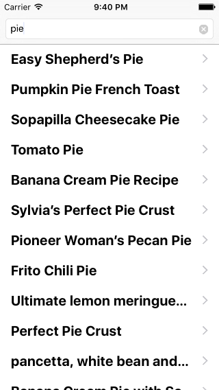
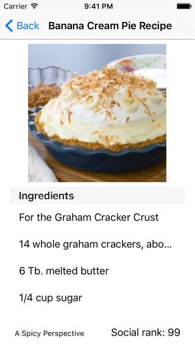
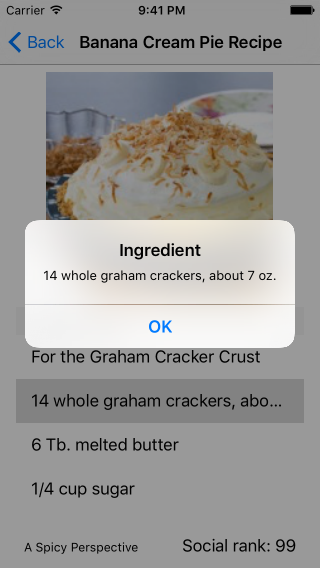
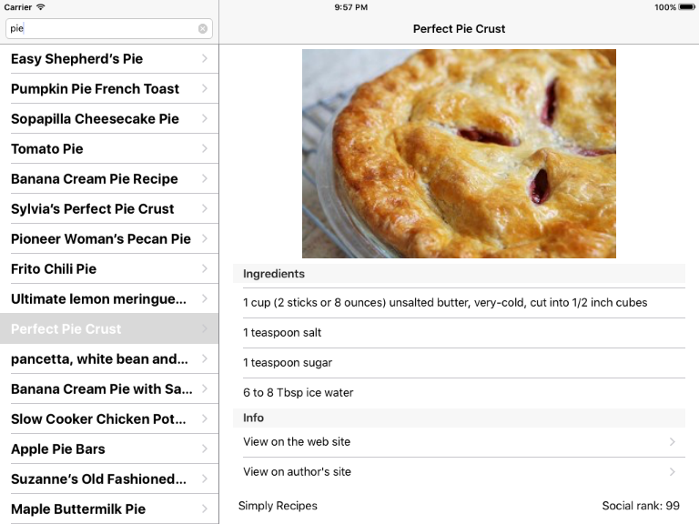
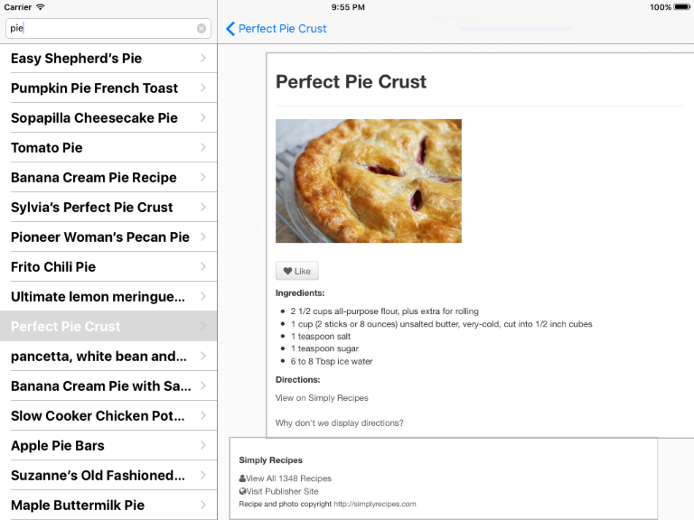

## Build instructions

1. Open "SocialRecipeCatalog.xcodeproj" in Xcode 7.
1. Build and run.

Icon taken from:
https://commons.wikimedia.org/wiki/File:Emoji_u1f35d.svg

Used libraries:
* PromiseKit legacy-1.x, tag: 1.7.3  
  https://github.com/mxcl/PromiseKit/commit/723f4ae15ebc349830c944e4973371ed8f010481
* SDWebImage 4.0.0-beta2  
  https://github.com/rs/SDWebImage/commit/032ab1dd6d633ed30b8850eddc27f7073191f317
* GTMNSString-HTML  
  https://github.com/siriusdely/GTMNSString-HTML/commit/5d81a06cc5ef42cf57821ae1a7afa468ef6f83ce

## Screenshots

